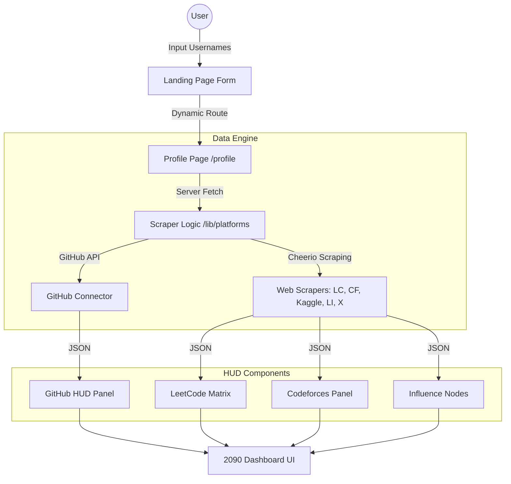

# 🌐 DevProfile — 2090 HUD Edition

A futuristic, high-density developer analytics dashboard that aggregates your engineering footprint from across the web into a single, visually striking "HUD" (Heads-Up Display).

 <!-- Replace with actual screenshot link when hosted -->

## 🚀 Vision
Built for the developers of 2090. No whitespace. No "fluff". Just pure data, scanned and ready for recruiter extraction. This project focuses on high-density data visualization and a "Cyber-Physical" aesthetic inspired by Apple's minimalism and Terminal hacker vibes.

## 🛠️ Tech Stack
- **Framework:** [Next.js 15+](https://nextjs.org/) (App Router)
- **Styling:** [Tailwind CSS](https://tailwindcss.com/) with custom Glassmorphism & CRT animations
- **Data Fetching:** [Cheerio](https://cheerio.js.org/) (Web Scraping) & Platform APIs
- **Visuals:** [Chart.js](https://www.chartjs.org/) (Radar Charts), [React Activity Calendar](https://github.com/grubersjoe/react-activity-calendar) (Heatmaps)
- **Icons:** [Heroicons](https://heroicons.com/) & Custom SVGs

## 🏗️ Architecture



## 📂 Project Structure
```text
src/
├── app/                  # Next.js Routes & API handlers
├── components/           # High-density HUD React components
│   ├── InfluenceCards.tsx # Kaggle, LinkedIn, Twitter Panels
│   ├── LeetCodeCard.tsx   # Ultra-dense LC Stats & Tags
│   ├── GitHubCard.tsx     # Engineering Matrix
│   └── ...
├── lib/
│   ├── platforms/        # Modular Scraper logic
│   └── utils.ts          # HUD decorative helpers
└── globals.css           # 2090 Core Aesthetic (Scanlines, Borders)
```

## 🛠️ Installation & Local Run

1. **Clone the repository:**
   ```bash
   git clone https://github.com/your-username/dev-share.git
   cd dev-share
   ```

2. **Install dependencies:**
   ```bash
   npm install
   ```

3. **Set up Environment Variables:**
   Create a `.env.local` file:
   ```env
   GITHUB_TOKEN=your_personal_access_token_here
   ```

4. **Run the development server:**
   ```bash
   npm run dev
   ```
   Open [http://localhost:3000](http://localhost:3000) to see the result.

## 🤝 Contributing
We love modularity! Want to add a new platform (e.g., GFG, CodeChef)? 
Check out our [Contributing Guide](CONTRIBUTING.md) to learn how to plug in a new scraper module.

## 📄 License
MIT
